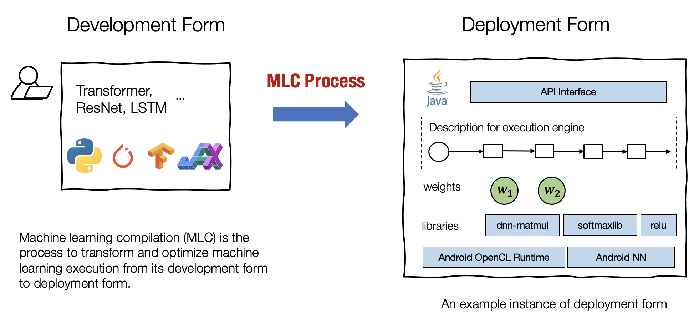
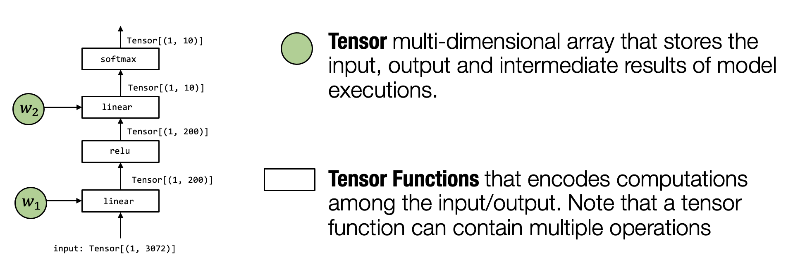

# 什么是机器学习编译
机器学习编译 (machine learning compilation, MLC) 是指将机器学习算法从开发阶段，通过变换和优化算法，使其变成部署状态。

- 开发形式: 是指我们在开发机器学习模型时使用的形式。典型的开发形式包括用 PyTorch、TensorFlow 或 JAX 等通用框架编写的模型描述，以及与之相关的权重
- 部署形式: 是指执行机器学习应用程序所需的形式。它通常涉及机器学习模型的每个步骤的支撑代码、管理资源（例如内存）的控制器，以及与应用程序开发环境的接口(例如用于 android 应用程序的 java API)

我们使用术语“编译 (compilation)”，因为可以将这个过程视为与传统编译器所做的非常相似的过程，即编译器将我们的应用程序采用开发形式，并将它们编译为可以部署的库。但是，机器学习编译在很多方面仍然不同于传统编译:
- 首先，这个过程不一定涉及代码生成。例如，部署形式可以是一组预定义的库函数，而 ML 编译仅将开发形式转换为对这些库的调用
- 其次，遇到的挑战和解决方案也大不相同

机器学习编译通常有以下几个目标：
- 集成与最小化依赖 部署过程通常涉及集成 (Integration)，即将必要的元素组合在一起以用于部署应用程序，代码集成、最小化依赖项的能力能够减小应用的大小，并且可以使应用程序部署到的更多的环境
- 利用硬件加速 每个部署环境都有自己的一套原生加速技术，并且其中许多是专门为机器学习开发的。机器学习编译的一个目标就是是利用硬件本身的特性进行加速
    - 可以通过构建调用原生加速库的部署代码
    - 可以通过生成利用原生指令（如 TensorCore）的代码
- 通用优化 有许多等效的方法可以运行相同的模型执行。 MLC 的通用优化形式是不同形式的优化，以最小化内存使用或提高执行效率的方式转换模型执行

# 机器学习编译的关键要素

在这个特定的模型中，我们通过展平输入图像中的像素来获取向量 (Vector)；然后，我们应用线性变换，将输入图像投影到长度为 200 的向量上，并运行ReLU 激活函数。最后，我们将其映射到长度为 10 的向量，向量的每个元素对应于图像属于该特定类别的可能性大小。

**张量 (Tensor)** 是执行中最重要的元素。张量是表示神经网络模型执行的输入、输出和中间结果的多维数组。

**张量函数 (Tensor functions)** 神经网络的“知识”被编码在权重和接受张量和输出张量的计算序列中。我们将这些计算称为张量函数。值得注意的是，张量函数不需要对应于神经网络计算的单个步骤。部分计算或整个端到端计算也可以看作张量函数。

我们有多种方法可以在特定环境中实现模型执行：

机器学习编译的过程就是是将上图左侧的内容转换为右侧的过程。在不同的场景中，这个过程可以是手动完成的，也可以使用一些自动转换工具，或两者兼而有之。
