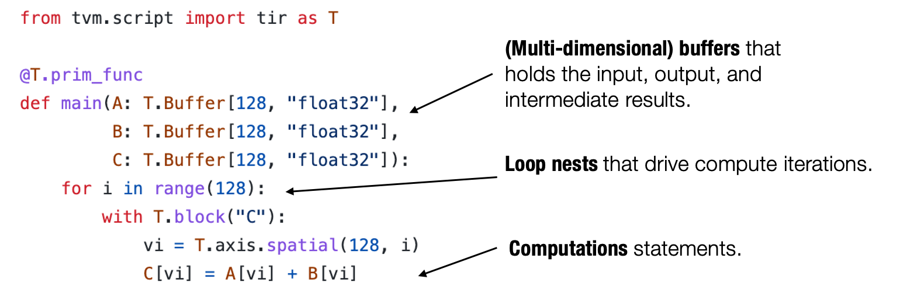
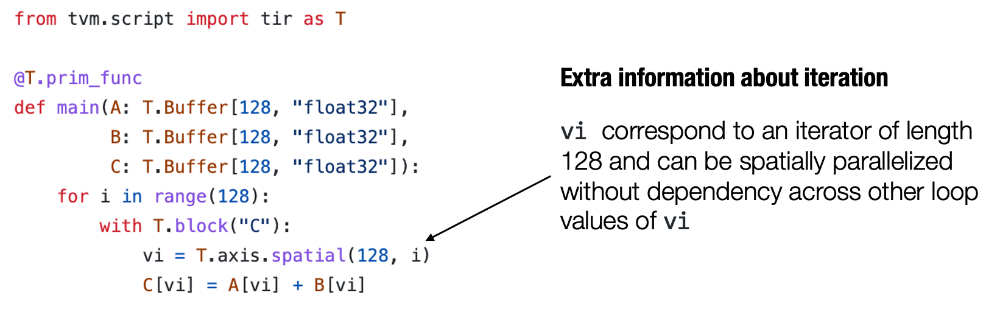

# 元张量函数
一个典型的机器学习模型的执行包含许多步将输入张量之间转化为最终预测的计算步骤，其中的每一步都被称为**元张量函数 (primitive tensor function)**。


在上面这张图中，张量算子 linear, add, relu 和 softmax 均为元张量函数。特别的是，许多不同的抽象能够表示（和实现）同样的元张量函数（正如下图所示）。我们可以选择调用已经预先编译的框架库（如 torch.add 和 numpy.add）并利用在 Python 中的实现。在实践中，元张量函数被例如 C 或 C++ 的低级语言所实现，并且在一些时候会包含一些汇编代码：


# 张量程序抽象
为了让我们能够更有效地变换元张量函数，我们需要一个有效的抽象来表示这些函数。通常来说一个典型的元张量函数实现的抽象包含了以下成分：
- 存储数据的多维数组
- 驱动张量计算的循环嵌套
- 计算部分本身的语句




我们称这类抽象为张量程序抽象。张量程序抽象的一个重要性质是：**他们能够被一系列有效的程序变换所改变**。

例如，我们能够通过一组变换操作（如循环拆分、并行和向量化）将下图左侧的一个初始循环程序变换为右侧的程序：


## 张量程序抽象中的其它结构
重要的是，我们不能任意地对程序进行变换，比方说这可能是因为一些计算会依赖于循环之间的顺序。张量程序可以将这些额外的信息合并为程序的一部分，以使程序变换更加便利。



上面图中的程序包含额外的 `T.axis.spatial` 标注，表明 `vi` 这个特定的变量被映射到循环变量 `i`，并且所有的迭代都是独立的。这个信息对于执行这个程序而言并非必要，但会使得我们在变换这个程序时更加方便。在这个例子中，我们知道我们可以安全地并行或者重新排序所有与 `vi` 有关的循环，只要实际执行中 `vi` 的值按照从 0 到 128 的顺序变化。

# TensorIR: 张量程序抽象案例研究
安装 MLC 包：
```
python3 -m  pip install mlc-ai-nightly -f https://mlc.ai/wheels
```

## TensorIR
TensorIR 是标准机器学习编译框架 Apache TVM 中使用的张量程序抽象。使用张量程序抽象的主要目的是表示循环和相关的硬件加速选择，如多线程、特殊硬件指令的使用和内存访问。

假设对于两个大小为 $128 \times 128$ 的矩阵 $A$ 和 $B$，我们进行如下两步的张量计算:
- $Y_{i, j} = \sum_k A_{i, k} \times B_{k, j}$
- $C_{i, j} = \mathbb{relu}(Y_{i, j}) = \mathbb{max}(Y_{i, j}, 0)$

即一个线性层与一个 ReLU 激活层。

导入库：
```
import numpy as np
import tvm
from tvm.ir.module import IRModule
from tvm.script import tir as T
```

使用 numpy 实现:
```
dtype = "float32"
a_np = np.random.rand(128, 128).astype(dtype)
b_np = np.random.rand(128, 128).astype(dtype)
c_mm_relu = np.maximum(a_np @ b_np, 0)
```
在底层，NumPy 调用库（例如 OpenBLAS）和它自己在低级 C 语言中的一些实现来执行这些计算。

先利用 numpy 实现一个基础版本：
```
def lnumpy_mm_relu(A: np.ndarray, B: np.ndarray, C: np.ndarray):
  # 分配中间结果存储空间
  Y = np.empty((128, 128), dtype="float32")

  for i in range(128):
    for j in range(128):
      for k in range(128):
        if k == 0:
          Y[i][j] = 0
        Y[i][j] = Y[i][j] + A[i][k] * B[k][j]
  
  for i in range(128):
    for j in range(128):
      C[i, j] = max(Y[i][j], 0)

c_np = np.empty((128, 128),dtype="float32")
lnumpy_mm_relu(a_np, b_np, c_np)
# 检验结果是否一致
np.testing.assert_allclose(c_mm_relu, c_np, rtol=1e-5)
```

上述实现中包含了计算实现的所有要素：
- 多维缓冲区（数组）
- 在数组维度上的循环
- 在循环下执行的计算语句

TVMScript 是一种嵌入在 Python AST 中的特定领域方言，使用 TVMScript 编写 TensorIR 的实现方式：
```
@tvm.script.ir_module
class MyModule:
  @T.prim_func
  def mm_relu(A: T.Buffer((128, 128),"float32"),
        B: T.Buffer((128, 128),"float32"),
        C: T.Buffer((128, 128),"float32")):
    T.func_attr({"global_symbol" : "mm_relu", "tir.alias" : True})
    Y = T.alloc_buffer((128, 128), dtype="float32")
    for i, j, k in T.grid(128, 128, 128):
      with T.block("Y"):
        vi = T.axis.spatial(128, i)
        vj = T.axis.spatial(128, j)
        vk = T.axis.reduce(128, k)

        with T.init():
          Y[vi, vj] = T.float32(0)
        Y[vi, vj] = Y[vi, vj] + A[vi, vk] * B[vk, vj]

    for i, j in T.grid(128, 128):
      with T.block("C"):
        vi = T.axis.spatial(128, i)
        vj = T.axis.spatial(128, j)
        C[vi, vj] = T.max(Y[vi, vj], T.float32(0))
```
- `T.grid` 是 TensorIR 中的语法糖，供我们书写多个嵌套的迭代器
- **块** 是 TensorIR 中的基本计算单位。一个块包含一组块轴（vi、vj、vk）和围绕它们定义的计算

块轴的关键性质，语法如下：
```
[block_axis] = T.axis.[axis_type]([axis_range], [mapped_value])
```
- axis_type: 块轴的属性（spatial, reduce）
- axis_range: 原始数据范围
- mapped_value：绑定到的位置


### 块轴的属性
块轴属性标记了轴与正在执行的计算之间的关系，下图总结了块（迭代）轴和块 `Y` 的读写关系。注意到，严格来说这个块正在对缓冲区 `Y` 进行（规约）更新，我们暂时将其标记为写入，因为我们不需要来自另一个块的缓冲区 `Y` 的值：


对于一组固定的 `vi` 和 `vj`，计算块在 `Y` 的空间位置 (`Y[vi, vj]`) 处生成一个点值，该点值独立于 `Y` 中的其他位置（具有不同的 `vi`, `vj` 值的位置）。我们可以称 `vi`、`vj` 为空间轴，因为它们直接对应于块写入的缓冲区空间区域的开始。 涉及归约的轴（`vk`）被命名为归约轴。

### 块轴绑定的语法糖

在每个块轴直接映射到外部循环迭代器的情况下，我们可以使用 T.axis.remap 在一行中声明所有块轴：
```
# SSR means the properties of each axes are "spatial", "spatial", "reduce"
vi, vj, vk = T.axis.remap("SSR", [i, j, k])
```

等价于:
```
vi = T.axis.spatial(range_of_i, i)
vj = T.axis.spatial(range_of_j, j)
vk = T.axis.reduce(range_of_k, k)
```

所以上面 TensorIR 的实现可以简化为：
```
@tvm.script.ir_module
class MyModuleWithAxisRemapSugar:
  @T.prim_func
  def mm_relu(A: T.Buffer((128, 128), dtype="float32"),
        B: T.Buffer((128, 128), dtype="float32"),
        C: T.Buffer((128, 128), dtype="float32")):
    T.func_attr({"global_symbol" : "mm_relu", "tir.noalias" : True})
    Y = T.alloc_buffer((128, 128), dtype="float32")
    for i, j, k in T.grid(128, 128, 128):
      with T.block("Y"):
        vi, vj, vk = T.axis.remap("SSR", [i, j, k])
        with T.init():
          Y[vi, vj] = T.float32(0)
        Y[vi, vj] = Y[vi, vj] + A[vi, vk] * B[vk, vj]
    
    for i, j in T.grid(128, 128):
      with T.block("C"):
        vi, vj = T.axis.remap("SS", [i, j])
        C[vi, vj] = T.max(Y[vi, vj], T.float32(0))
```

### 函数属性和装饰器
函数属性信息包含关于函数的额外信息:
```
T.func_attr({"global_symbol": "mm_relu", "tir.noalias": True})
```
`global_symbol` 对应函数名，`tir.noalias` 是一个属性，表示所有的缓冲存储器不重叠。

`@tvm.script.ir_module` 和 `@T.prim_func` 这两个装饰器用于表示对应部分的类型。

`@tvm.script.ir_module` 表示 `MyModule` 是一个 `IRModule`。`IRModule` 是在机器学习编译中保存张量函数集合的容器对象：
```
type(MyModule)

# 输出：
tvm.ir.module.IRModule

type(MyModule["mm_relu"])

# 输出：
tvm.tir.function.PrimFunc
```

机器学习编译过程中的一个 `IRModule` 可以包含多个张量函数。 以下代码块显示了具有两个函数的 `IRModule` 示例：
```
@tvm.script.ir_module
class MyModuleWithTwoFunctions:
  @T.prim_func
  def mm(A: T.Buffer((128, 128), dtype="float32"),
        B: T.Buffer((128, 128), dtype="float32"),
        C: T.Buffer((128, 128), dtype="float32")):
    T.func_attr({"global_symbol" : "mm", "tir.noalias" : True})

    Y = T.alloc_buffer((128, 128), dtype="float32")
    for i, j, k in T.grid(128, 128, 128):
      with T.block("Y"):
        vi, vj, vk = T.axis.remap("SSR", [i, j, k])
        with T.init():
          Y[vi, vj] = T.float32(0)
        Y[vi, vj] = Y[vi, vj] + A[vi, vk] * B[vk, vj]
  
  @T.prim_func
  def relu(A: T.Buffer((128, 128), "float32"),
       B: T.Buffer((128, 128), "float32")):
  
    T.func_attr({"global_symbol": "relu", "tir.noalias": True})
    for i, j in T.grid(128, 128):
        with T.block("B"):
            vi, vj = T.axis.remap("SS", [i, j])
            B[vi, vj] = T.max(A[vi, vj], T.float32(0))
```

## 变换
`mm_relu` 在实践中，可以有多种方法来实现相同的功能，并且每种实现都可能导致不同的性能。

```
def lnumpy_mm_relu_v2(A: np.ndarray, B: np.ndarray, C: np.ndarray):
  Y = np.empty((128, 128), dtype="float32")
  for i in range(128):
    for j0 in range(32):
      for k in range(128):
        for j1 in range(4):
          j = j0 * 4 + j1
          if k == 0:
            Y[i, j] = 0
          Y[i, j] = Y[i, j] + A[i, k] * B[k, j]
  
  for i in range(128):
    for j in range(128):
      C[i, j] = max(Y[i, j], 0)

c_np = np.empty((128, 128), dtype="float")
lnumpy_mm_relu_v2(a_np, b_np, c_np)
np.testing.assert_allclose(c_mm_relu, c_np, rtol=1e-5)
```

上面的代码块显示了 `mm_relu` 的一个稍微不同的变体。它与原始程序的不同是:
- 用两个循环 `j0` 和 `j1` 替换了 `j` 循环
- 迭代顺序略有变化

查看 `MyModule`:
```
import IPython
IPython.display.Code(MyModule.script(), language="python")
``` 
输出：
```
# from tvm.script import ir as I
# from tvm.script import tir as T

@I.ir_module
class Module:
    @T.prim_func
    def mm_relu(A: T.Buffer((128, 128), "float32"), B: T.Buffer((128, 128), "float32"), C: T.Buffer((128, 128), "float32")):
        T.func_attr({"global_symbol": "mm_relu", "tir.noalias": True})
        # with T.block("root"):
        Y = T.alloc_buffer((128, 128))
        for i, j, k in T.grid(128, 128, 128):
            with T.block("Y"):
                vi, vj, vk = T.axis.remap("SSR", [i, j, k])
                T.reads(A[vi, vk], B[vk, vj])
                T.writes(Y[vi, vj])
                with T.init():
                    Y[vi, vj] = T.float32(0)
                Y[vi, vj] = Y[vi, vj] + A[vi, vk] * B[vk, vj]
        for i, j in T.grid(128, 128):
            with T.block("C"):
                vi, vj = T.axis.remap("SS", [i, j])
                T.reads(Y[vi, vj])
                T.writes(C[vi, vj])
                C[vi, vj] = T.max(Y[vi, vj], T.float32(0))
```

TensorIR 引入了一个名为 Schedule 的辅助结构，用于进行变换：
```
sch = tvm.tir.Schedule(MyModule)
```

执行以下操作以获得对块 Y 和相应循环的引用:
```
block_Y = sch.get_block("Y", func_name="mm_relu")
i, j, k = sch.get_loops(block_Y)
```

执行第一个变换是将循环 `j` 分成两个循环，其中内部循环的长度为 4。请注意，变换是程序性的，因此如果你不小心执行了两次该代码块，我们将得到“变量 j 不再存在”的错误：
```
j0, j1 = sch.split(j, factors=[None, 4])
```

查看变换后的结果：
```
IPython.display.Code(sch.mod.script(), language="python")
```

输出结果：
```
# from tvm.script import ir as I
# from tvm.script import tir as T

@I.ir_module
class Module:
    @T.prim_func
    def mm_relu(A: T.Buffer((128, 128), "float32"), B: T.Buffer((128, 128), "float32"), C: T.Buffer((128, 128), "float32")):
        T.func_attr({"tir.alias": T.bool(True)})
        # with T.block("root"):
        Y = T.alloc_buffer((128, 128))
        for i, j_0, j_1, k in T.grid(128, 32, 4, 128):
            with T.block("Y"):
                vi = T.axis.spatial(128, i)
                vj = T.axis.spatial(128, j_0 * 4 + j_1)
                vk = T.axis.reduce(128, k)
                T.reads(A[vi, vk], B[vk, vj])
                T.writes(Y[vi, vj])
                with T.init():
                    Y[vi, vj] = T.float32(0)
                Y[vi, vj] = Y[vi, vj] + A[vi, vk] * B[vk, vj]
        for i, j in T.grid(128, 128):
            with T.block("C"):
                vi, vj = T.axis.remap("SS", [i, j])
                T.reads(Y[vi, vj])
                T.writes(C[vi, vj])
                C[vi, vj] = T.max(Y[vi, vj], T.float32(0))
```
现在重新排序后的代码非常类似于 `lnumpy_mm_relu_v2`。

我们将继续进行另外两步变换以得到另一个变体。首先，我们使用名为 `reverse_compute_at` 的原语将块 `C` 移动到 `Y` 的内循环里：
```
block_C = sch.get_block("C", "mm_relu")
sch.reverse_compute_at(block_C, j0)
IPython.display.Code(sch.mod.script(), language="python")
```

输出：
```
# from tvm.script import ir as I
# from tvm.script import tir as T

@I.ir_module
class Module:
    @T.prim_func
    def mm_relu(A: T.Buffer((128, 128), "float32"), B: T.Buffer((128, 128), "float32"), C: T.Buffer((128, 128), "float32")):
        T.func_attr({"tir.alias": T.bool(True)})
        # with T.block("root"):
        Y = T.alloc_buffer((128, 128))
        for i, j_0 in T.grid(128, 32):
            for j_1, k in T.grid(4, 128):
                with T.block("Y"):
                    vi = T.axis.spatial(128, i)
                    vj = T.axis.spatial(128, j_0 * 4 + j_1)
                    vk = T.axis.reduce(128, k)
                    T.reads(A[vi, vk], B[vk, vj])
                    T.writes(Y[vi, vj])
                    with T.init():
                        Y[vi, vj] = T.float32(0)
                    Y[vi, vj] = Y[vi, vj] + A[vi, vk] * B[vk, vj]
            for ax0 in range(4):
                with T.block("C"):
                    vi = T.axis.spatial(128, i)
                    vj = T.axis.spatial(128, j_0 * 4 + ax0)
                    T.reads(Y[vi, vj])
                    T.writes(C[vi, vj])
                    C[vi, vj] = T.max(Y[vi, vj], T.float32(0))
```

在循环变换之后，我们可以将 `Y` 元素的初始化与归约更新分开。我们可以通过 `decompose_reduction` 原语来做到这一点。（注意：这也是 TVM 在以后编译的时候隐式做的，所以这一步的主要目的是让它显式，看看最终效果）：

```
sch.decompose_reduction(block_Y, k)
IPython.display.Code(sch.mod.script(), language="python")
```

输出：
```
# from tvm.script import ir as I
# from tvm.script import tir as T

@I.ir_module
class Module:
    @T.prim_func
    def mm_relu(A: T.Buffer((128, 128), "float32"), B: T.Buffer((128, 128), "float32"), C: T.Buffer((128, 128), "float32")):
        T.func_attr({"tir.alias": T.bool(True)})
        # with T.block("root"):
        Y = T.alloc_buffer((128, 128))
        for i, j_0 in T.grid(128, 32):
            for j_1 in range(4):
                with T.block("Y_init"):
                    vi = T.axis.spatial(128, i)
                    vj = T.axis.spatial(128, j_0 * 4 + j_1)
                    T.reads()
                    T.writes(Y[vi, vj])
                    Y[vi, vj] = T.float32(0)
                for k in range(128):
                    with T.block("Y_update"):
                        vi = T.axis.spatial(128, i)
                        vj = T.axis.spatial(128, j_0 * 4 + j_1)
                        vk = T.axis.reduce(128, k)
                        T.reads(Y[vi, vj], A[vi, vk], B[vk, vj])
                        T.writes(Y[vi, vj])
                        Y[vi, vj] = Y[vi, vj] + A[vi, vk] * B[vk, vj]
            for ax0 in range(4):
                with T.block("C"):
                    vi = T.axis.spatial(128, i)
                    vj = T.axis.spatial(128, j_0 * 4 + ax0)
                    T.reads(Y[vi, vj])
                    T.writes(C[vi, vj])
                    C[vi, vj] = T.max(Y[vi, vj], T.float32(0))
```

最终变换后的代码类似于以下低级 NumPy 代码:
```
def lnumpy_mm_relu_v3(A: np.ndarray, B: np.ndarray, C: np.ndarray):
    Y = np.empty((128, 128), dtype="float32")
    for i in range(128):
        for j0 in range(32):
            # Y_init
            for j1 in range(4):
                j = j0 * 4 + j1
                Y[i, j] = 0
            # Y_update
            for k in range(128):
                for j1 in range(4):
                    j = j0 * 4 + j1
                    Y[i, j] = Y[i, j] + A[i, k] * B[k, j]
            # C
            for j1 in range(4):
                j = j0 * 4 + j1
                C[i, j] = max(Y[i, j], 0)

c_np = np.empty((128, 128), dtype=dtype)
lnumpy_mm_relu_v3(a_np, b_np, c_np)
np.testing.assert_allclose(c_mm_relu, c_np, rtol=1e-5)
```

## 构建与运行
调用构建函数将 IRModule 变换为 `runtime.Module`，它表示可运行函数的集合。 这里 `target` 指定了部署环境的详细信息。对于现在这种特殊情况，我们将使用 `llvm`，它可以帮助我们编译到本机 CPU 平台:
```
rt_lib = tvm.build(MyModule, target="llvm")

a_nd = tvm.nd.array(a_np)
b_nd = tvm.nd.array(b_np)
c_nd = tvm.nd.empty((128, 128), dtype="float32")

# 从 rt_lib 中获取可运行函数并执行
func_mm_relu = rt_lib["mm_relu"]
func_mm_relu(a_nd, b_nd, c_nd)
np.testing.assert_allclose(c_mm_relu, c_nd.numpy(), rtol=1e-5)
```
`a_nd` 等的类型为：
```
tvm.runtime.ndarray.NDArray
```
可以通过调用 `numpy` 转换成 numpy 的 `ndarray`。

还可以构建运行变换后的程序:
```
rt_lib_after = tvm.build(sch.mod, target="llvm")
rt_lib_after["mm_relu"](a_nd, b_nd, c_nd)
np.testing.assert_allclose(c_mm_relu, c_nd.numpy(), rtol=1e-5)
```

最后，我们可以比较一下两者的时间差。 time_evaluator 是一个辅助的测试函数，可用于比较不同生成函数的运行性能：
```
f_timer_before = rt_lib.time_evaluator("mm_relu", tvm.cpu())
print(f"Time cost of MyModule {f_timer_before(a_nd, b_nd, c_nd).mean} seconds")
f_timer_after = rt_lib_after.time_evaluator("mm_relu", tvm.cpu())
print(f"Time cost of transformed sch.mod {f_timer_after(a_nd, b_nd, c_nd).mean} seconds")
```

输出结果：
```
Time cost of MyModule 0.0042990899 seconds
Time cost of transformed sch.mod 0.002988246 seconds
```

要了解为什么不同的循环变体会导致不同的性能，我们需要回顾一个事实，即访问 A 和 B 中的任何内存块的速度并不一致。现代 CPU 带有多级缓存，需要先将数据提取到缓存中，然后 CPU 才能访问它。


重要的是，访问已经在缓存中的数据要快得多。CPU 采用的一种策略是获取彼此更接近的数据。 当我们读取内存中的一个元素时，它会尝试将附近的元素（更正式的名称为“缓存行”）获取到缓存中。 因此，当你读取下一个元素时，它已经在缓存中。 因此，具有连续内存访问的代码通常比随机访问内存不同部分的代码更快。
