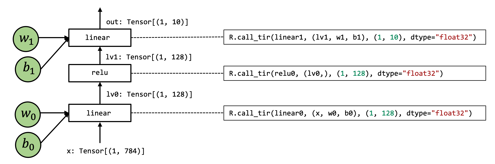

# 导入库
```
import IPython
import numpy as np
import tvm
from tvm import relax
from tvm.ir.module import IRModule
from tvm.script import relax as R
from tvm.script import tir as T
```

# 准备数据集和模型参数

## 加载数据集
```
import torch
import torchvision

test_data = torchvision.datasets.FashionMNIST(root="data", train=False, download=True, transform=torchvision.transforms.ToTensor())
test_loader = torch.utils.data.DataLoader(test_data, batch_size=1, shuffle=True)
class_names = ['T-shirt/top', 'Trouser', 'Pullover', 'Dress', 'Coat',
               'Sandal', 'Shirt', 'Sneaker', 'Bag', 'Ankle boot']
img, label = next(iter(test_loader))
img = img.reshape(1, 28, 28).numpy()
```

我们可以绘制出我们希望能够预测的图像：
```
import matplotlib.pyplot as plt

plt.figure()
plt.imshow(img[0])
plt.colorbar()
plt.grid(False)
plt.show()
print(f"Class: {class_names[label[0]]}")
```


```
Class: T-shirt/top
```

## 下载模型参数
```
# Hide outputs
!wget https://github.com/mlc-ai/web-data/raw/main/models/fasionmnist_mlp_params.pkl
```

# 端到端模型整合
我们将使用以下模型作为示例。这是一个两层神经网络，由两个全连接层和一个有 relu 激活层组成。为了简化问题，我们删除了最终的 softmax 层。输出分数是未标准化的，但最大值仍然对应于最可能的类别：


# Numpy 实现
```
def numpy_mlp(data, w0, b0, w1, b1):
  lv0 = data @ w0.T + b0
  lv1 = np.maximum(lv0, 0)
  lv2 = lv1 @ w1.T + b1
  return lv2
```

运行模型：
```
import pickle as pkl

mlp_params = pkl.load(open("fasionmnist_mlp_params.pkl", "rb"))
res = numpy_mlp(img.reshape(1, 784),
                mlp_params["w0"],
                mlp_params["b0"],
                mlp_params["w1"],
                mlp_params["b1"])
print(res)
pred_kind = res.argmax(axis=1)
print(pred_kind)
print(f"Numpy-MLP Prediction: {class_names[pred_kind[0]]}")
```

输出：
```
[[ 36.977055 -20.72949   -3.975003 -15.184228 -50.152027 -49.21976
    8.625975 -51.778065 -28.319672 -56.04041 ]]
[0]
Numpy-MLP Prediction: T-shirt/top
```

为了说明底层细节，我们将再次用底层 NumPy 编写示例：
- 使用循环而不是数组函数来演示循环计算
- 通过 `np.empty` 显式分配数组并传递它们

```
def lnumpy_linear0(X: np.ndarray, W: np.ndarray, B: np.ndarray, Z: np.ndarray):
  Y = np.empty((1, 128), dtype="float32")
  for i in range(1):
    for j in range(128):
      for k in range(784):
        if k == 0:
          Y[i, j] = 0
        Y[i, j] = Y[i, j] + X[i, k] * W[j, k]
  
  for i in range(1):
    for j in range(128):
      Z[i, j] = Y[i, j] +B[j]

def lnumpy_relu0(X: np.ndarray, Y: np.ndarray):
  for i in range(1):
    for j in range(128):
      Y[i, j] = np.maximum(X[i, j], 0)

def lnumpy_linear1(X: np.ndarray, W: np.ndarray, B: np.ndarray, Z: np.ndarray):
  Y = np.empty((1, 10), dtype="float32")
  for i in range(1):
    for j in range(10):
      for k in range(128):
        if k == 0:
          Y[i, j] = 0
        Y[i, j] = Y[i, j] + X[i, k] * W[j, k]
  
  for i in range(1):
    for j in range(10):
      Z[i, j] = Y[i, j] +B[j]

def lnumpy_mlp(data, w0, b0, w1, b1):
  lv0 = np.empty((1, 128), dtype="float32")
  lnumpy_linear0(data, w0, b0, lv0)

  lv1 = np.empty((1, 128),dtype="float32")
  lnumpy_relu0(lv0, lv1)

  out = np.empty((1, 10), dtype="float32")
  lnumpy_linear1(lv1, w1, b1, out)
  return out

result = lnumpy_mlp(img.reshape(1, 784), 
           mlp_params["w0"],
           mlp_params["b0"],
           mlp_params["w1"],
           mlp_params["b1"])
pred_kind = result.argmax(axis=1)
print(f"Low-Level Numpy MLP Predicton: {class_names[pred_kind[0]]}")
```

输出：
```
Low-Level Numpy MLP Predicton: T-shirt/top
```

# 在 TVMScript 中构建端到端 IRModule
```
@tvm.script.ir_module
class MyModule:
    @T.prim_func
    def relu0(x: T.handle, y: T.handle):
        n = T.int64()
        X = T.match_buffer(x, (1, n), "float32")
        Y = T.match_buffer(y, (1, n), "float32")
        for i, j in T.grid(1, n):
            with T.block("Y"):
                vi, vj = T.axis.remap("SS", [i, j])
                Y[vi, vj] = T.max(X[vi, vj], T.float32(0))

    @T.prim_func
    def linear0(x: T.handle,
                w: T.handle,
                b: T.handle,
                z: T.handle):
        m, n, k = T.int64(), T.int64(), T.int64()
        X = T.match_buffer(x, (1, m), "float32")
        W = T.match_buffer(w, (n, m), "float32")
        B = T.match_buffer(b, (n, ), "float32")
        Z = T.match_buffer(z, (1, n), "float32")
        Y = T.alloc_buffer((1, n), "float32")
        for i, j, k in T.grid(1, n, m):
            with T.block("Y"):
                vi, vj, vk = T.axis.remap("SSR", [i, j, k])
                with T.init():
                    Y[vi, vj] = T.float32(0)
                Y[vi, vj] = Y[vi, vj] + X[vi, vk] * W[vj, vk]
        for i, j in T.grid(1, n):
            with T.block("Z"):
                vi, vj = T.axis.remap("SS", [i, j])
                Z[vi, vj] = Y[vi, vj] + B[vj]

    @R.function
    def main(x: R.Tensor((1, "m"), "float32"),
             w0: R.Tensor(("n", "m"), "float32"),
             b0: R.Tensor(("n", ), "float32"),
             w1: R.Tensor(("k", "n"), "float32"),
             b1: R.Tensor(("k", ), "float32")):
        m, n, k = T.int64(), T.int64(), T.int64()
        with R.dataflow():
            lv0 = R.call_dps_packed("linear0", (x, w0, b0), R.Tensor((1, n), "float32"))
            lv1 = R.call_dps_packed("relu0", (lv0, ), R.Tensor((1, n), "float32"))
            out = R.call_dps_packed("linear0", (lv1, w1, b1), R.Tensor((1, k), "float32"))
            R.output(out)
        return out    
```
Relax 函数是一种表示上层神经网络执行的全新抽象。

main 函数的计算图视图：


## call_dps_packed
`R.call_dps_packed` 操作是引入元张量函数的过程：
```
lv0 = R.call_dps_packed("linear0", (x, w0, b0), R.Tensor((1, n), dtype="float32"))
```

例如使用 numpy 实现 `具体来说，call_dps_packed`：
```
def lnumpy_call_dps_packed(prim_func, inputs, shape, dtype):
    res = np.empty(shape, dtype=dtype)
    prim_func(*inputs, res)
    return res
```

具体来说，`call_dps_packed` 接受一个元函数 (`prim_func`) 的输入列表，并分配一个输出张量res，然后将输入和输出传递给`prim_func`。 执行 `prim_func` 后，结果会填充到 `res` 中，然后我们可以返回结果。

call_dps_packed 使我们能够隐藏调用低层元函数细节，并将它们应用到计算图中:

```
def lnumpy_mlp_with_call_dps_packed(data, w0, b0, w1, b1):
    lv0 = lnumpy_call_dps_packed(lnumpy_linear0, (data, w0, b0), (1, 128), dtype="float32")
    lv1 = lnumpy_call_dps_packed(lnumpy_relu0, (lv0, ), (1, 128), dtype="float32")
    out = lnumpy_call_dps_packed(lnumpy_linear1, (lv1, w1, b1), (1, 10), dtype="float32")
    return out

result = lnumpy_mlp_with_call_dps_packed(
    img.reshape(1, 784),
    mlp_params["w0"],
    mlp_params["b0"],
    mlp_params["w1"],
    mlp_params["b1"])

pred_kind = np.argmax(result, axis=1)
print("Low-level Numpy with CallTIR Prediction:", class_names[pred_kind[0]])
```

## Dataflow Block
Relax 函数中的另一个重要元素是 R.dataflow() 范围标注：
```
with R.dataflow():
    lv0 = R.call_dps_packed("linear0", (x, w0, b0), R.Tensor((1, n), "float32"))
    lv1 = R.call_dps_packed("relu0", (lv0, ), R.Tensor((1, n), "float32"))
    out = R.call_dps_packed("linear0", (lv1, w1, b1), R.Tensor((1, k), "float32"))
    R.output(out)
```

 dataflow block是我们标记程序计算图区域的一种方式。 具体来说，在dataflow block中，所有操作都需要side-effect free。 在dataflow block之外，操作可能包含side-effect。 下面的程序是一个包含两个dataflow block的示例程序：

 ```
@R.function
def main(x: R.Tensor((1, "m"), "float32"),
        w0: R.Tensor(("n", "m"), "float32"),
        b0: R.Tensor(("n", ), "float32"),
        w1: R.Tensor(("k", "n"), "float32"),
        b1: R.Tensor(("k", ), "float32")):
    m, n, k = T.int64(), T.int64(), T.int64()

    with R.dataflow():
        lv0 = R.call_dps_packed("linear0", (x, w0, b0), R.Tensor((1, n), "float32"))
        gv0 = R.call_dps_packed("relu0", (lv0, ), R.Tensor((1, n), "float32"))
        R.output(gv0)

    with R.dataflow():
        out = R.call_dps_packed("linear0", (gv0, w1, b1), R.Tensor((1, k), "float32"))
        R.output(out)
    return out
 ```

# 构建并运行模型
查看当前的 IRModule:
```
IPython.display.Code(MyModule.script(), language="python")
```

输出结果：
```
# from tvm.script import ir as I
# from tvm.script import tir as T
# from tvm.script import relax as R

@I.ir_module
class Module:
    @T.prim_func
    def linear0(x: T.handle, w: T.handle, b: T.handle, z: T.handle):
        m = T.int64()
        X = T.match_buffer(x, (1, m))
        n = T.int64()
        W = T.match_buffer(w, (n, m))
        B = T.match_buffer(b, (n,))
        Z = T.match_buffer(z, (1, n))
        # with T.block("root"):
        Y = T.alloc_buffer((1, n))
        for i, j, k in T.grid(1, n, m):
            with T.block("Y"):
                vi, vj, vk = T.axis.remap("SSR", [i, j, k])
                T.reads(X[vi, vk], W[vj, vk])
                T.writes(Y[vi, vj])
                with T.init():
                    Y[vi, vj] = T.float32(0)
                Y[vi, vj] = Y[vi, vj] + X[vi, vk] * W[vj, vk]
        for i, j in T.grid(1, n):
            with T.block("Z"):
                vi, vj = T.axis.remap("SS", [i, j])
                T.reads(Y[vi, vj], B[vj])
                T.writes(Z[vi, vj])
                Z[vi, vj] = Y[vi, vj] + B[vj]

    @T.prim_func
    def relu0(x: T.handle, y: T.handle):
        n = T.int64()
        X = T.match_buffer(x, (1, n))
        Y = T.match_buffer(y, (1, n))
        # with T.block("root"):
        for i, j in T.grid(1, n):
            with T.block("Y"):
                vi, vj = T.axis.remap("SS", [i, j])
                T.reads(X[vi, vj])
                T.writes(Y[vi, vj])
                Y[vi, vj] = T.max(X[vi, vj], T.float32(0))

    @R.function
    def main(x: R.Tensor((1, "m"), dtype="float32"), w0: R.Tensor(("n", "m"), dtype="float32"), b0: R.Tensor(("n",), dtype="float32"), w1: R.Tensor(("k", "n"), dtype="float32"), b1: R.Tensor(("k",), dtype="float32")) -> R.Tensor((1, "k"), dtype="float32"):
        k = T.int64()
        m = T.int64()
        n = T.int64()
        with R.dataflow():
            lv0 = R.call_dps_packed("linear0", (x, w0, b0), out_sinfo=R.Tensor((1, n), dtype="float32"))
            lv1 = R.call_dps_packed("relu0", (lv0,), out_sinfo=R.Tensor((1, n), dtype="float32"))
            out = R.call_dps_packed("linear0", (lv1, w1, b1), out_sinfo=R.Tensor((1, k), dtype="float32"))
            R.output(out)
        return out
```

我们调用 `relax.build` 来构建这个函数：
```
ex = relax.build(MyModule, target="llvm")
print(type(ex))  # <class 'tvm.relax.vm_build.Executable'>
```

build 函数会给我们一个可执行文件（译者注：“可执行文件”并非传统操作系统中的可执行文件，不能直接在系统中运行，而是针对Relax VM设计的一种文件格式）。 我们可以初始化一个虚拟机执行器，使我们能够运行该函数。 此外，我们将传入第二个参数，指示我们要在哪个设备上进行端到端执行：
```
vm = relax.VirtualMachine(ex, tvm.cpu())
```
构建包含输入数据和权重的 tvm NDArray:
```
data_nd = tvm.nd.array(img.reshape(1, 784))
nd_params = {k: tvm.nd.array(v) for k, v in mlp_params.items()}
```

传入输入参数和权重来运行 main 函数:
```
nd_res = vm["main"](data_nd,
          nd_params["w0"],
          nd_params["b0"],
          nd_params["w1"],
          nd_params["b1"])

pred_kind = np.argmax(nd_res.numpy(), axis=1)
print(f"MyModule Prediction: {class_names[pred_kind[0]]}")
```

输出：
```
MyModule Prediction: T-shirt/top
```

# 在环境中集成现有运行库

在许多情况下，我们可能希望将现有的库函数集成到 MLC 过程中。下面的 `IRModule` 展示了如何做到这一点：

```
@tvm.script.ir_module
class MyModuleWithExternCall:
    @R.function
    def main(x: R.Tensor((1, "m"), "float32"),
             w0: R.Tensor(("n", "m"), "float32"),
             b0: R.Tensor(("n", ), "float32"),
             w1: R.Tensor(("k", "n"), "float32"),
             b1: R.Tensor(("k", ), "float32")):
        # block 0
        m, n, k = T.int64(), T.int64(), T.int64()
        with R.dataflow():
            lv0 = R.call_dps_packed("env.linear", (x, w0, b0), R.Tensor((1, n), "float32"))
            lv1 = R.call_dps_packed("env.relu", (lv0, ), R.Tensor((1, n), "float32"))
            out = R.call_dps_packed("env.linear", (lv1, w1, b1), R.Tensor((1, k), "float32"))
            R.output(out)
        return out
```
直接在 `call_dps_packed` 中传入字符串(`"env.linear"`、`"env.relu"`、`"env.linear"`)，这些字符串是我们期望在模型执行期间的运行时函数的名称。

## 注册运行时函数
为了能够执行调用外部函数的代码，我们需要注册相应的函数。 下面的代码注册了函数的两个实现(依赖 torch 的底层实现)：
```
@tvm.register_func("env.linear", override=True)
def torch_linear(x: tvm.nd.NDArray,
                 w: tvm.nd.NDArray,
                 b: tvm.nd.NDArray,
                 out: tvm.nd.NDArray):
    x_torch = torch.from_dlpack(x)
    w_torch = torch.from_dlpack(w)
    b_torch = torch.from_dlpack(b)
    out_torch = torch.from_dlpack(out)
    torch.mm(x_torch, w_torch.T, out=out_torch)
    torch.add(out_torch, b_torch, out=out_torch)

@tvm.register_func("env.relu", override=True)
def lnumpy_relu(x: tvm.nd.NDArray,
                out: tvm.nd.NDArray):
    x_torch = torch.from_dlpack(x)
    out_torch = torch.from_dlpack(out)
    torch.maximum(x_torch, torch.Tensor([0.0]), out=out_torch)
```

使用 from_dlpack 将 TVM NDArray 转换为 torch NDArray。 请注意，这是一个零拷贝转换，这意味着 Torch 阵列与 TVM NDArray 共享底层内存。 DLPack 是一种通用的交换标准，允许不同的框架交换 Tensor/NDArray 而无需参与数据复制。 

在真实的应用场景中，我们可以使用类似的机制将调用重定向到特定的库，例如 cuDNN 或我们自己的库实现。

## 编译和运行

```
ex = relax.build(MyModuleWithExternCall, target="llvm")
vm = relax.VirtualMachine(ex, tvm.cpu())

nd_res = vm["main"](data_nd,
                    nd_params["w0"],
                    nd_params["b0"],
                    nd_params["w1"],
                    nd_params["b1"])

pred_kind = np.argmax(nd_res.numpy(), axis=1)
print(f"MyModuleWithExternCall  Prediction: {class_names[pred_kind[0]]}")
```

输出：
```
MyModuleWithExternCall  Prediction: T-shirt/top
```

# 混合 TensorIR 和 库
在上一个示例中，我们构建了一个 IRModule，其中所有元操作都被分派给运行库。有时将两者混合使用会有所帮助:
```
@tvm.script.ir_module
class MyModuleMixture:
    @T.prim_func
    def linear0(x: T.handle,
                w: T.handle,
                b: T.handle,
                z: T.handle):
        m, n, k = T.int64(), T.int64(), T.int64()
        X = T.match_buffer(x, (1, m), "float32")
        W = T.match_buffer(w, (n, m), "float32")
        B = T.match_buffer(b, (n, ), "float32")
        Z = T.match_buffer(z, (1, n), "float32")
        Y = T.alloc_buffer((1, n), "float32")
        for i, j, k in T.grid(1, n, m):
            with T.block("Y"):
                vi, vj, vk = T.axis.remap("SSR", [i, j, k])
                with T.init():
                    Y[vi, vj] = T.float32(0)
                Y[vi, vj] = Y[vi, vj] + X[vi, vk] * W[vj, vk]
        for i, j in T.grid(1, n):
            with T.block("Z"):
                vi, vj = T.axis.remap("SS", [i, j])
                Z[vi, vj] = Y[vi, vj] + B[vj]

    @R.function
    def main(x: R.Tensor((1, "m"), "float32"),
             w0: R.Tensor(("n", "m"), "float32"),
             b0: R.Tensor(("n", ), "float32"),
             w1: R.Tensor(("k", "n"), "float32"),
             b1: R.Tensor(("k", ), "float32")):
        m, n, k = T.int64(), T.int64(), T.int64()
        with R.dataflow():
            lv0 = R.call_dps_packed("linear0", (x, w0, b0), R.Tensor((1, n), "float32"))
            lv1 = R.call_dps_packed("env.relu", (lv0, ), R.Tensor((1, n), "float32"))
            out = R.call_dps_packed("env.linear", (lv1, w1, b1), R.Tensor((1, k), "float32"))
            R.output(out)
        return out
```
其中 `linear0` 仍然在 TensorIR 中实现，而其余函数被重定向到库函数。 我们可以构建并运行以验证结果:

```
ex = relax.build(MyModuleMixture, target="llvm")
vm = relax.VirtualMachine(ex, tvm.cpu())

nd_res = vm["main"](data_nd,
                    nd_params["w0"],
                    nd_params["b0"],
                    nd_params["w1"],
                    nd_params["b1"])

pred_kind = np.argmax(nd_res.numpy(), axis=1)
print(f"MyModuleMixture  Prediction: {class_names[pred_kind[0]]}")
```

输出：
```
MyModuleMixture  Prediction: T-shirt/top
```

# 将参数绑定到 IRModule
在到目前为止的所有示例中，我们通过显式传递参数来构造主函数。 在许多情况下，将参数绑定为附加到 `IRModule` 的常量通常会降低 API 的复杂程度。 以下代码通过将参数名称与 nd_params 中的键匹配来创建绑定:
```
MyModuleWithParams = relax.transform.BindParams("main", nd_params)(MyModuleMixture)
IPython.display.Code(MyModuleWithParams.script(), language="python")
```

输出：
```
# from tvm.script import ir as I
# from tvm.script import tir as T
# from tvm.script import relax as R

@I.ir_module
class Module:
    @T.prim_func
    def linear0(x: T.handle, w: T.handle, b: T.handle, z: T.handle):
        m = T.int64()
        X = T.match_buffer(x, (1, m))
        n = T.int64()
        W = T.match_buffer(w, (n, m))
        B = T.match_buffer(b, (n,))
        Z = T.match_buffer(z, (1, n))
        # with T.block("root"):
        Y = T.alloc_buffer((1, n))
        for i, j, k in T.grid(1, n, m):
            with T.block("Y"):
                vi, vj, vk = T.axis.remap("SSR", [i, j, k])
                T.reads(X[vi, vk], W[vj, vk])
                T.writes(Y[vi, vj])
                with T.init():
                    Y[vi, vj] = T.float32(0)
                Y[vi, vj] = Y[vi, vj] + X[vi, vk] * W[vj, vk]
        for i, j in T.grid(1, n):
            with T.block("Z"):
                vi, vj = T.axis.remap("SS", [i, j])
                T.reads(Y[vi, vj], B[vj])
                T.writes(Z[vi, vj])
                Z[vi, vj] = Y[vi, vj] + B[vj]

    @R.function
    def main(x: R.Tensor((1, 784), dtype="float32")) -> R.Tensor((1, 10), dtype="float32"):
        with R.dataflow():
            lv0 = R.call_dps_packed("linear0", (x, metadata["relax.expr.Constant"][0], metadata["relax.expr.Constant"][1]), out_sinfo=R.Tensor((1, 128), dtype="float32"))
            lv1 = R.call_dps_packed("env.relu", (lv0,), out_sinfo=R.Tensor((1, 128), dtype="float32"))
            out = R.call_dps_packed("env.linear", (lv1, metadata["relax.expr.Constant"][2], metadata["relax.expr.Constant"][3]), out_sinfo=R.Tensor((1, 10), dtype="float32"))
            R.output(out)
        return out

# Metadata omitted. Use show_meta=True in script() method to show it.
```

如果我们构建转换后的 `IRModule`，我们现在可以通过传入输入数据来调用该函数:
```
ex = relax.build(MyModuleWithParams, target="llvm")
vm = relax.VirtualMachine(ex, tvm.cpu())

nd_res = vm["main"](data_nd)

pred_kind = np.argmax(nd_res.numpy(), axis=1)
print(f"MyModuleWithParams  Prediction: {class_names[pred_kind[0]]}")
```

输出：
```
MyModuleWithParams  Prediction: T-shirt/top
```

# 总结
MLC 过程是在不同的抽象表示之间执行并在它们之间进行转换：


端到端执行中有许多可能的转换。 例如，我们可以使用 `MyModuleMixture` 中的 `TensorIR` 函数，并使用上一课中讲授的调度操作更改 `linear0` 函数。 在其他情况下，我们可能希望将高层模型执行转换为库函数调用和 `TensorIR` 函数的混合体。

Relax 抽象的关键要素包括:
- `call_dps_packed` 构造，将目标传递规范的元函数嵌入到计算图中
- `Dataflow block`

